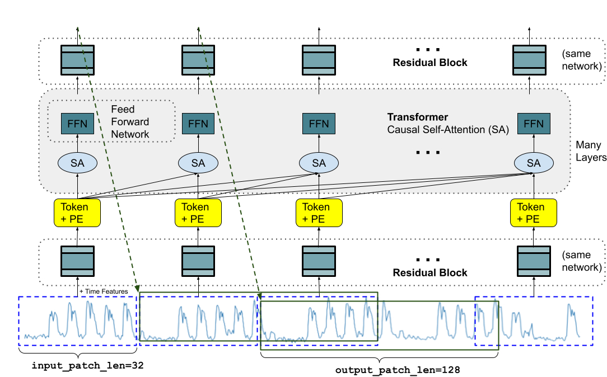
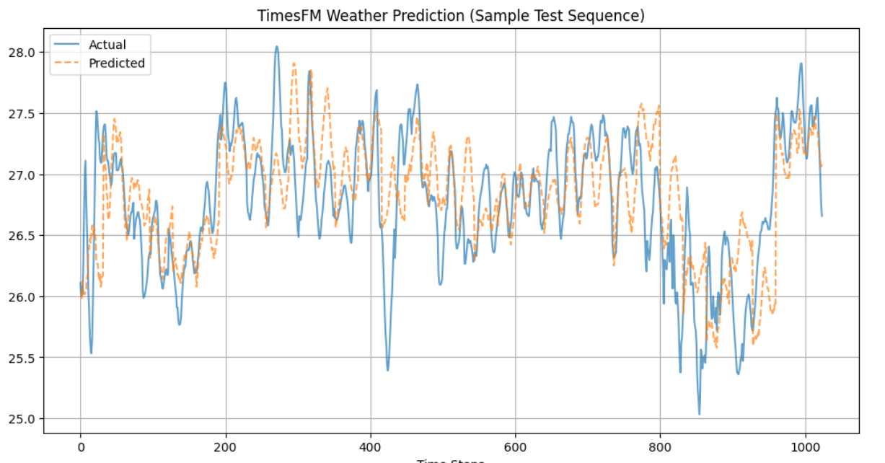
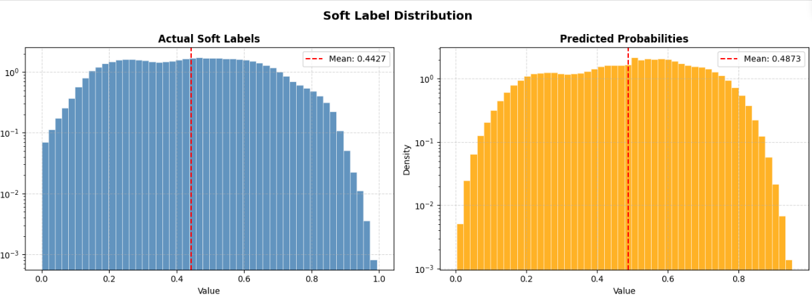
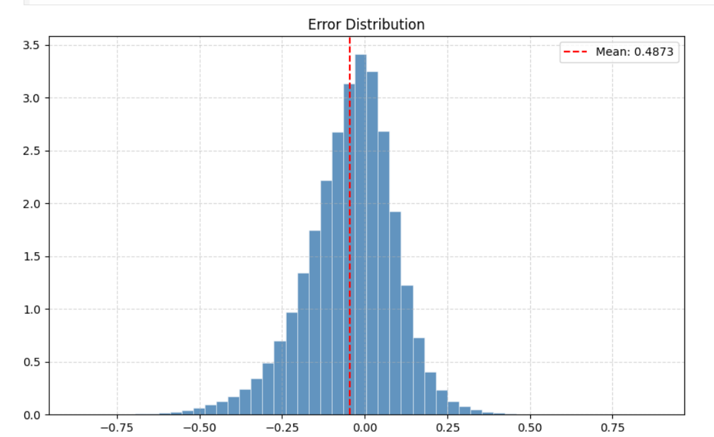

# Time Series Foundational Model for Weather Forecasting

## Overview
There are many foundational models for textual data that handle long documents with long-range dependencies. Similarly, in time-series data, predictions depend on past trends and historical patterns.

Traditional models such as LSTM and RNN struggle with long-range dependencies. Transformers provide significantly better performance for such tasks.

In this project, a time-series forecasting model is developed using a Transformer-based architecture to predict weather conditions based on historical weather data.

---

## Data Collection

- The dataset is sourced from the ERA5 database.Link [ERA5_weather_data](https://cds.climate.copernicus.eu/datasets/reanalysis-era5-single-levels?tab=overview)
- It spans from 2013 to 2025.
- The data is stored in GRIB format instead of CSV or Excel.

### What is GRIB?
GRIB (Gridded Binary) is a machine-optimized format designed to efficiently store large, multi-dimensional weather datasets such as temperature, wind, pressure, humidity, and rainfall.

These datasets span latitude–longitude grids, multiple altitudes, and various time steps.

### Dataset Features
The dataset contains:
- time
- latitude
- longitude
- valid_time
- temperature

### Dataset Size
- Approximately 120 million data points per year
- Suitable for training large-scale foundational models

---

## Model Architecture

The model is built using the Google TimesFM architecture, designed for time-series forecasting.

### Architecture Diagram

  

---

## Pretraining Results

The model achieved the following performance:

| Metric      | Value     |
|-------------|----------|
| MSE         | 1.092779 |
| RMSE        | 0.936533 |
| MAE         | 0.510166 |
| Huber Loss  | 0.22472  |

### Prediction vs Actual (Test Set)

  

---

## Anomaly Detection

### Definition
Anomaly detection identifies data points that deviate significantly from normal patterns.

In this project, the model outputs the probability of each data point being anomalous.

---

## Importance of Anomaly Detection

### Detect Extreme Weather Events
- Heatwaves  
- Cold waves  
- Sudden temperature spikes  

### Energy and Power Management
Temperature anomalies affect:
- Electricity demand  
- Cooling systems  

Business value:
- Predict peak electricity usage  
- Prevent grid overload  
- Optimize energy distribution  

---

## Techniques Used

### Transfer Learning
- Initially applied but resulted in low precision

### Knowledge Distillation
- Improved performance compared to transfer learning  
- Knowledge transferred from the teacher model (pretrained model) to the student model  
- Original teacher model as around 1.2 million parameters distilled model has 95k parameters approximately 92% reduction in number of parameters

---

## Data Preparation for Distillation

1. Extract predicted temperatures from the pretrained model  
2. Generate:
   - Soft labels (probabilities)
   - Hard labels (binary classification)  
3. Train the student model  

For further information, refer to the notebook in the notebooks folder.

---

## Results from Knowledge Distillation

### Soft Label Distribution

  

### Error Distribution

  

---

## Conclusion

- Transformer-based models improve time-series forecasting performance  
- Knowledge distillation is more effective than transfer learning for anomaly detection  
- The system detects anomalies with applications in weather forecasting, energy management, and risk prediction  

